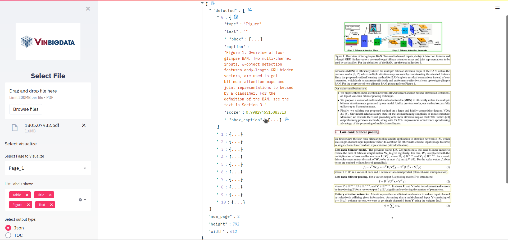

# Document Layout Analysis
> Tools for extract figure, table, text,... from a pdf document

## About The Project

## Installation

See [Installed](https://github.com/Wild-Rift/Document-Layout-Analysis/tree/staging).

## Training model

See [Train model](https://github.com/Wild-Rift/Document-Layout-Analysis/tree/dev)

## Evalutate model

See [Colab Notebook](https://colab.research.google.com/drive/1WBzVAgLdldrX6Gs1lbUaUPF63fkjcw4t?usp=sharing)

## My Team.

1.  [Pham Van Tien](https://github.com/vietnamican)
2.  [Nguyen Trung Duc](https://github.com/caoboiyb)
3.  [Tran Tien Quan]()
4.  [Bui Xuan Thoai](https://github.com/ThanThoai)